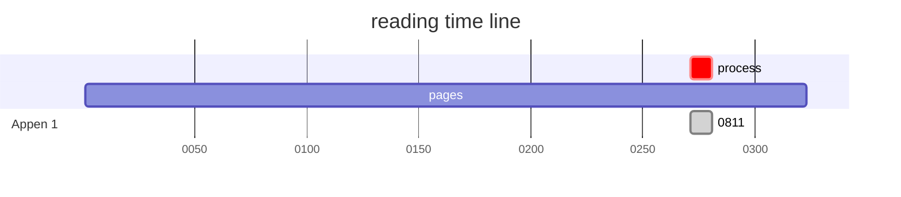
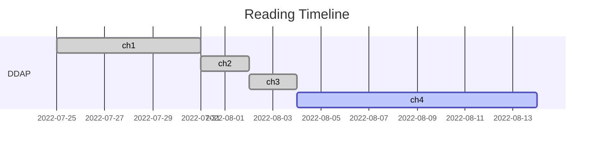
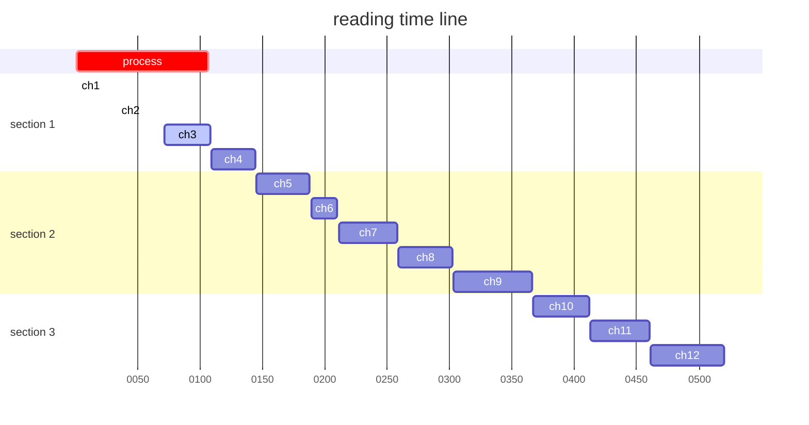

# Mastering Bitcoin: Programming the Open Blockchain
## 精通区块链编程：加密货币原理、方法和应用开发 - 读书笔记

| chapter |title| start | finish |process|
| :-----:| :----: | :----: |:----: |:----: |
|Appen 1|比特币白皮书|2022-08-11|2022-08-11|/|

